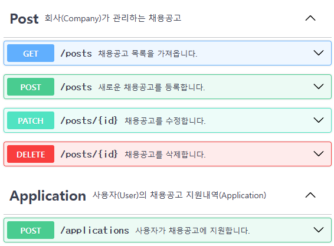
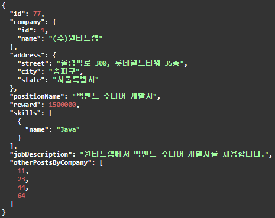

# API 설계

과제에 제시된 기능 구현을 위하여 REST API 설계를 수행하였습니다.

작성한 OpenAPI 문서 [링크](../api-description/wanted-0.0.1.yaml)

## 예제와 달리한 내용

### 채용공고(Post)

요구사항 분석 시 언급한대로, 국가와 지역은 `주소`로 묶고 변경하였습니다. 그리고 기술(skill)은 보통 1개 이상이기 때문에 여러개가 올 수 있도록 하였습니다.

이외에는 API 상에서 요구사항 분석 시 언급했던 것과 특별히 달라진 것은 없습니다.

### 400(Bad Request) vs 422(Unprocessable Content)

유효성 검사 실패 시 400과 422 중에 어떤 것을 사용하여야 할지 혼란스러웠는데, 정리가 잘된 글이 있어 참고하여 `422`로 결정하였습니다.

[quora 링크](https://www.quora.com/Which-HTTP-code-is-best-suited-for-validation-errors-400-or-422)

Use 400 if the query is `syntactically` incorrect.
Use 422 if the query is `semantically` incorrect.