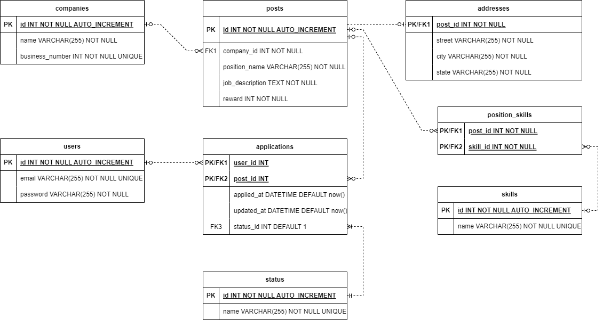

# 데이터베이스 설계

이전에 설계한 도메인 모델을 바탕으로 데이터 모델링을 수행하였습니다.

## ERD



## SQL

ERD를 바탕으로 작성한 SQL을 작성합니다.

### users

```sql
CREATE TABLE `users` (
    `id` INT NOT NULL AUTO_INCREMENT,
    `email` VARCHAR(255) NOT NULL UNIQUE,
    `password` VARCHAR(255) NOT NULL,
    PRIMARY KEY(id)
);
```

email의 경우 조사 결과 최대 길이가 254글자 입니다. 그리고 password는 길면 길수록 좋지만, 너무 길면 해싱 속도가 느려져 서비스 거부 공격에 악용될 수 있으므로 무한정 길게 하는 것은 권장되지 않고 있습니다. 그래서 password를 일반적으로 길이를 확정하기 어려울 때 많이 사용되는 255글자로 설정하고, 통일성을 위해 email도 255글자로 설정하였습니다.

### companies

```sql
CREATE TABLE `companies` (
    `id` INT NOT NULL AUTO_INCREMENT,
    `name` VARCHAR(255) NOT NULL,
    `business_number` INT NOT NULL UNIQUE,
    PRIMARY KEY(id)
);

```

회사 이름의 길이는 다양하지만 사람들이 기억하기쉽게 하느라 장문의 회사명을 짓지는 않으므로 255글자를 상한으로 하였습니다.

그리고 사업자등록번호(business_number)는 국내에서 유일하므로, UNIQUE 제약을 설정하였습니다.

### posts

```sql
CREATE TABLE `posts` (
    `id` INT NOT NULL AUTO_INCREMENT,
    `company_id` INT NOT NULL,
    `position_name` VARCHAR(255) NOT NULL,
    `job_description` TEXT NOT NULL,
    `reward` INT NOT NULL,
    PRIMARY KEY(id)
);

CREATE TABLE `addresses` (
    `post_id` INT NOT NULL,
    `street` VARCHAR(255) NOT NULL,
    `city` VARCHAR(255) NOT NULL,
    `state` VARCHAR(255) NOT NULL,
    PRIMARY KEY(post_id),
    FOREIGN KEY(post_id) REFERENCES posts(id) ON DELETE CASCADE
);

CREATE TABLE `skills` (
    `id` INT NOT NULL AUTO_INCREMENT,
    `name` VARCHAR(255) NOT NULL UNIQUE,
    PRIMARY KEY(id)
);

CREATE TABLE `position_skills` (
    `post_id` INT NOT NULL,
    `skill_id` INT NOT NULL,
    PRIMARY KEY(post_id, skill_id),
    FOREIGN KEY(post_id) REFERENCES posts(id) ON DELETE CASCADE,
    FOREIGN KEY(skill_id) REFERENCES skills(id) ON DELETE CASCADE
);
```

채용공고의 주소는 별도의 테이블(addresses)로 분리하였는데, 규모가 작아서 통합하는 것도 괜찮아보입니다. 하지만 아직 JPA가 익숙하지 않아 관계 설정 연습을 위해 최대한 테이블을 분리하였습니다.

스킬의 경우 여러 개의 스킬이 올 수 있으므로, 스킬 테이블(skills) 별도로 분리하였으며, 확장 시 사용자의 스킬도 입력받아 공고와 매칭 시키는 등에 활용할 수 있어 합리적이라 판단됩니다.

### applications

```sql
CREATE TABLE `status` (
    `id` INT NOT NULL AUTO_INCREMENT,
    `name` VARCHAR(255) NOT NULL UNIQUE,
    PRIMARY KEY(id)
);

CREATE TABLE `applications` (
    `user_id` INT,
    `post_id` INT,
    `applied_at` DATETIME DEFAULT now(),
    `updated_at` DATETIME DEFAULT now(),
    `status_id` INT DEFAULT 1,
    FOREIGN KEY(user_id) REFERENCES users(id) ON DELETE SET NULL,
    FOREIGN KEY(post_id) REFERENCES posts(id) ON DELETE SET NULL,
    FOREIGN KEY(status_id) REFERENCES status(id) ON UPDATE CASCADE
);
```

applications는 users와 posts 간의 다대다 관계 테이블로, 요구사항 분석 시 추가한 속성들을 컬럼으로 추가하였습니다. 그리고 전형 상태를 확인할 수 있는 참조 테이블(status)을 추가하였습니다.