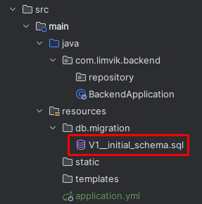

# 프로젝트 설정

기본적인 설계가 마무리되어 구현을 시작하기 전에 프로젝트 생성 및 환경설정을 수행합니다.

## Spring Boot 프로젝트 생성

Spring Initializr를 이용하여 새로운 프로젝트를 생성합니다.


Spring Initializr([링크](https://start.spring.io/#!type=gradle-project&language=java&platformVersion=3.1.4&packaging=jar&jvmVersion=17&groupId=com.limvik&artifactId=backend&name=backend&description=Wanted%20pre%20onboarding%20backend&packageName=com.limvik.backend&dependencies=devtools,lombok,docker-compose,web,data-jpa,flyway,mysql,validation,testcontainers))

### 라이브러리 추가 목적

- Spring Boot DevTools, Lombok: 개발 편의성 향상
- Docker Compose Support: 개발환경과 배포환경 차이 감소
- Spring Web: 요청 및 응답처리를 위한 REST API 구현
- Spring Data JPA: ORM 사용 요구사항 충족 및 학습
- Flyway Migration: 데이터베이스 버전 관리
- MySQL Driver: RDBMS 사용 요구사항 충족
- Validation: 유효성 검사
- Testcontainers: 테스트환경과 배포환경 차이 감소

## 프로젝트 설정

### Flyway

먼저 Flyway를 이용하여 데이터베이스 변경을 관리하기 위해 resources/db/migration 디렉토리 밑에 파일을 만들어줍니다.



V1은 첫 번째 버전을 의미하며, 그 뒤에 필수적으로 underscore(_)가 2개 와야 합니다.

### Docker

개발환경과 배포환경의 차이를 최소화하기 위해 Docker를 사용합니다.

#### Dockerfile

```dockerfile
FROM eclipse-temurin:17 AS builder
LABEL authors="limvik"

WORKDIR workspace
ARG JAR_FILE=build/libs/*.jar
COPY ${JAR_FILE} wanted.jar
RUN java -Djarmode=layertools -jar wanted.jar extract

FROM eclipse-temurin:17
RUN useradd limvik
USER limvik
WORKDIR workspace
COPY --from=builder workspace/dependencies/ ./
COPY --from=builder workspace/spring-boot-loader/ ./
COPY --from=builder workspace/snapshot-dependencies/ ./
COPY --from=builder workspace/application/ ./
ENTRYPOINT ["java", "org.springframework.boot.loader.JarLauncher"]
```

- JDK는 오픈소스인 eclipse temurin의 17버전을 사용합니다.
- 컨테이너 이미지 빌드 시 변경된 layer만 변경을 반영하여 개발 속도를 향상시킵니다.
- Spring Boot에서는 Dockerfile 없이 OCI 표준 이미지 빌드도 가능하지만, 세부적으로 조정하는 방법을 아직 학습하지 못해서 Dockerfile로 진행합니다.

#### compose.yaml

Docker compose를 이용하여 개발환경을 세팅합니다.

```yaml
version: "3.8"

services:
  mysql:
    image: 'mysql:8.0.34'
    container_name: wanted_db
    restart: always
    environment:
      - 'MYSQL_DATABASE=wanted'
      - 'MYSQL_PASSWORD=password'
      - 'MYSQL_ROOT_PASSWORD=rootpassword'
      - 'MYSQL_USER=limvik'
    command:
      - --character-set-server=utf8mb4
      - --collation-server=utf8mb4_unicode_ci
    ports:
      - '33306:3306'
  app:
    build:
      context: .
      dockerfile: Dockerfile
    restart: always
    container_name: wanted_app
    develop:
      watch:
        - action: rebuild
          path: ./build/libs
    depends_on:
      mysql:
        condition: service_started
    ports:
      - '9001:9001'
  adminer:
    image: adminer
    restart: always
    ports:
      - '8081:8080'
```

#### application.yml

기본 설정을 수행합니다.

```yaml
server:
  port: 9001
  tomcat:
    connection-timeout: 2s
    keep-alive-timeout: 15s
    threads:
      max: 50
      min-spare: 5

spring:
  application:
    name: wanted
  datasource:
    username: limvik
    password: password
    url: jdbc:mysql://wanted_db:3306/wanted
    hikari:
      connection-timeout: 2000
      maximum-pool-size: 5
  jpa:
    hibernate:
      ddl-auto: validate
```

- tomcat의 스레드 수를 기본값 보다 줄여, 개발 시 자원 소모량을 낮추어줍니다.
- datasource는 compose 파일에서 설정한 데이터베이스 관련 설정을 입력합니다.
- flyway를 통해 관리되는 스키마가 있으므로, hibernate 의 ddl-auto 설정은 검증만 수행하도록 validate로 설정합니다.

#### application-integration.yml

`integration` profile에서 사용할 설정값을 지정합니다.

현재는 Testcontainers 를 사용하기 위한 datasource 설정을 합니다.

```yaml
spring:
  datasource:
    url: jdbc:tc:mysql:8.0.34:///
```

이에 맞추어 기본으로 작성되어 있는 테스트 파일의 내용을 수정합니다.

아래는 Testcontainers를 설정하기 위한 Java 클래스입니다.

```java
package com.limvik.backend;

import org.springframework.boot.SpringApplication;
import org.springframework.boot.test.context.TestConfiguration;
import org.springframework.boot.testcontainers.service.connection.ServiceConnection;
import org.springframework.context.annotation.Bean;
import org.testcontainers.containers.MySQLContainer;
import org.testcontainers.utility.DockerImageName;

@TestConfiguration(proxyBeanMethods = false)
public class TestBackendApplication {

	@Bean
	@ServiceConnection
	MySQLContainer<?> mysqlContainer() {
		return new MySQLContainer<>(DockerImageName.parse("mysql:8.0.34"));
	}

	public static void main(String[] args) {
		SpringApplication.from(BackendApplication::main).with(TestBackendApplication.class).run(args);
	}

}
```

Spring Boot 기본 테스트인 컨텍스트 로드 테스트에서 임의의 포트를 사용하도록 설정하고, Testcontainers를 사용하도록 `integration` profile을 불러오는 설정을 합니다.

```java
package com.limvik.backend;

import org.junit.jupiter.api.Test;
import org.springframework.boot.test.context.SpringBootTest;
import org.springframework.test.context.ActiveProfiles;

@SpringBootTest(webEnvironment = SpringBootTest.WebEnvironment.RANDOM_PORT)
@ActiveProfiles("integration")
class BackendApplicationTests {

	@Test
	void contextLoads() {
	}

}

```

