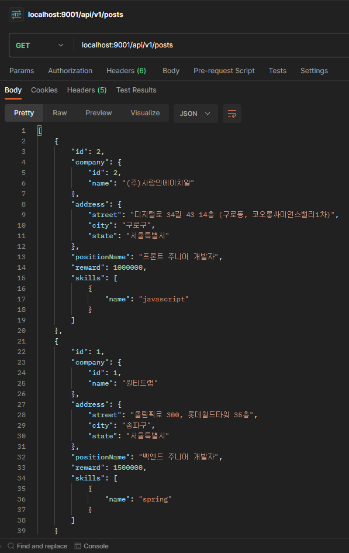

# 채용공고(posts) 조회 기능 구현

## 도메인 객체 구현

첫 기능이므로 기본적인 도메인 객체를 데이터베이스 설계한 내용을 바탕으로 구현하였습니다.

## 채용공고 조회 관련 저장소(Repository) 테스트 작성 및 구현

### 테스트 작성

Repository 테스트를 작성하면서, Repository에서 구현해야 할 메서드를 식별합니다. 테스트 데이터는 너무 길어서 여기서는 생략합니다.

#### 전체 목록 조회 테스트

전체 목록을 받아오는 것은 기본적으로 지원하는 메서드인 findAll()을 사용할 수 있으므로 특별히 구현할 것이 없는 테스트를 작성합니다.

```java
@Test
void findAllPosts() {
    Iterable<Post> posts = postRepository.findAll();

    assertThat(StreamSupport.stream(posts.spliterator(), true)
            .filter(post -> post.getPositionName().equals("백엔드 주니어 개발자") ||
                            post.getPositionName().equals("프론트 주니어 개발자"))
            .collect(Collectors.toList())).hasSize(2);
}
```

#### 키워드기반 목록 조회 테스트

키워드를 기반으로 채용공고 내용에 키워드 포함여부를 조회하기 위한 테스트를 작성합니다. search() 메서드와, 채용공고에 지정한 스킬을 기반으로 채용공고를 조회하기 위한 findPostIdsBySkillId() 메서드가 필요한 것을 식별할 수 있습니다. 그리고 스킬 이름을 기반으로 스킬의 id를 조회하기 위해 Skill Repository에서는 findByName() 메서드가 필요합니다.

```java
@Test
void findAllPostByKeywordInPositionNameAndJobDescription() {
    String keyword = "react";
    Long reactSkillId = skillRepository.findByName(keyword).get().getId();
    List<Post> posts1 = postRepository.search(keyword);
    assertThat(posts1).hasSize(1);
    List<Post> posts2 = postRepository.findAllById(positionSkillRepository.findPostIdsBySkillId(reactSkillId));
    assertThat(posts2).hasSize(0);
}

@Test
void findAllPostByKeywordInSkill() {
    String keyword = "spring";
    Long SpringSkillId = skillRepository.findByName(keyword).get().getId();
    List<Post> posts1 = postRepository.search(keyword);
    assertThat(posts1).hasSize(0);
    List<Post> posts2 = postRepository.findAllById(positionSkillRepository.findPostIdsBySkillId(SpringSkillId));
    assertThat(posts2).hasSize(1);
}
```

### 구현

테스트를 통과하기 위해 Repository 메서드를 만들면 다음과 같습니다.

```java
public interface SkillRepository extends JpaRepository<Skill, Long> {

    Optional<Skill> findByName(String name);

}

public interface PositionSkillRepository extends JpaRepository<PositionSkill, PositionSkillKey> {

    @Query("SELECT p.ids.postId FROM PositionSkill p WHERE p.ids.skillId = :id")
    Set<Long> findPostIdsBySkillId(@Param("id") Long id);

}

public interface PostRepository extends JpaRepository<Post, Long> {

    @Query("SELECT p FROM Post p WHERE p.positionName LIKE %:keyword% OR p.jobDescription LIKE %:keyword%")
    List<Post> search(@Param("keyword") String keyword);

}
```

## 채용공고 조회 관련 서비스(Service) 테스트 작성 및 구현

### 테스트 작성

앞선 과정과 동일하게 진행합니다.

#### 전체 목록 조회 테스트

Repository와 마찬가지로 페이징을 구현하지 않았으므로, 모든 목록을 채용공고를 역순으로 불러오는 테스트를 작성합니다.

```java
@Test
void getAllPost() {
    when(postRepository.findAll()).thenReturn(List.of(Post.builder().id(1L).build(), Post.builder().id(2L).build()));

    assertThat(postService.getPosts().size()).isEqualTo(2);
    assertThat(postService.getPosts().get(1).getId()).isEqualTo(1L);
}
```

#### 키워드기반 목록 조회 테스트

`java`로 검색했을 때, skill 을 먼저 검색하여 java의 id를 찾습니다. 그리고 skill id로 해당하는 skill을 필수스킬로 설정한 채용공고 id 를 불러옵니다.

불러온 채용공고 id로 채용공고 데이터를 조회하고, 키워드로도 데이터를 조회하여 중복된 데이터는 제거하고 불러오는 테스트를 작성합니다.

```java
@Test
void getAllPostByKeyword() {
    when(skillRepository.findByName("java")).thenReturn(Optional.of(new Skill(1L, "java", null)));
    when(positionSkillRepository.findPostIdsBySkillId(1L)).thenReturn(Set.of(1L, 2L, 3L));
    when(postRepository.findAllById(Set.of(1L, 2L, 3L))).thenReturn(
            List.of(Post.builder().id(1L).build(), Post.builder().id(2L).build(), Post.builder().id(3L).build()));
    when(postRepository.search("java")).thenReturn(List.of(Post.builder().id(1L).build()));

    assertThat(postService.getPostsByKeyword("java").size()).isEqualTo(3);
    assertThat(postService.getPostsByKeyword("java").get(2).getId()).isEqualTo(1L);
}
```

### 구현

테스트를 통과하는 Service 클래스를 구현합니다.

```java
public List<Post> getPosts() {
    return postRepository.findAll().stream().sorted((o1, o2) -> Long.compare(o2.getId(), o1.getId())).toList();
}

public List<Post> getPostsByKeyword(String keyword) {
    Set<Post> posts = getPostsBySkillName(keyword);
    posts.addAll(postRepository.search(keyword));
    return posts.stream().sorted((o1, o2) -> Long.compare(o2.getId(), o1.getId())).toList();
}

private Set<Post> getPostsBySkillName(String name) {
    var skill = skillRepository.findByName(name);
    Set<Post> posts = new HashSet<>();
    if (skill.isPresent()) {
        var postIds = positionSkillRepository.findPostIdsBySkillId(skill.get().getId());
        posts.addAll(postRepository.findAllById(postIds));
    }
    return posts;
}
```

## 채용공고 조회 관련 컨트롤러(Controller) 테스트 작성 및 구현

### 전체 목록 조회 테스트

검색 키워드 없이 전체 목록이 조회되는지 테스트를 작성합니다.

```java
@Test
void returnAllPosts() throws Exception {

    var post1 = Post.builder()
            .id(1L)
            .company(Company.builder().name("(주)원티드랩").build())
            .address(Address.builder().street("올림픽로 300, 롯데월드타워 35층").city("송파구").state("서울특별시").build())
            .build();

    var post2 = Post.builder()
            .id(2L)
            .company(Company.builder().name("(주)사람인에이치알").build())
            .address(Address.builder().street("디지털로 34길 43 14층 (구로동, 코오롱싸이언스밸리1차)").city("구로구").state("서울특별시").build())
            .build();

    given(postService.getPosts())
            .willReturn(List.of(post1, post2));

    mockMvc.perform(get("/api/v1/posts"))
            .andExpect(status().isOk())
            .andExpect(content().string(containsString("원티드랩")))
            .andExpect(content().string(containsString("송파구")))
            .andExpect(content().string(containsString("(주)사람인에이치알")))
            .andExpect(content().string(containsString("구로구")));

}
```

### 키워드기반 목록 조회 테스트

키워드를 입력했을 때 적합한 목록이 조회되는지 테스트를 작성합니다.

```java
@Test
void returnAllPostsByKeyword() throws Exception {

    var post1 = Post.builder()
            .id(1L)
            .company(Company.builder().name("(주)원티드랩").build())
            .address(Address.builder().street("올림픽로 300, 롯데월드타워 35층").city("송파구").state("서울특별시").build())
            .positionName("주니어 백엔드 개발자")
            .positionSkills(Set.of(new PositionSkill(new Post(), new Skill("java"))))
            .build();

    var post2 = Post.builder()
            .id(2L)
            .company(Company.builder().name("(주)사람인에이치알").build())
            .address(Address.builder().street("디지털로 34길 43 14층 (구로동, 코오롱싸이언스밸리1차)").city("구로구").state("서울특별시").build())
            .jobDescription("주니어 프론트엔드 개발자를 모집합니다.")
            .build();

    given(postService.getPostsByKeyword("주니어"))
            .willReturn(List.of(post1, post2));

    mockMvc.perform(get("/api/v1/posts?search=주니어"))
            .andExpect(status().isOk())
            .andExpect(content().string(containsString("(주)원티드랩")))
            .andExpect(content().string(containsString("송파구")))
            .andExpect(content().string(containsString("(주)사람인에이치알")))
            .andExpect(content().string(containsString("구로구")));

    given(postService.getPostsByKeyword("java"))
            .willReturn(List.of(post1));

    mockMvc.perform(get("/api/v1/posts?search=java"))
            .andExpect(status().isOk())
            .andExpect(content().string(containsString("(주)원티드랩")))
            .andExpect(content().string(containsString("송파구")));

}
```

지금과 같은 방식이면 Controller 쪽은 Exception 발생했을 때 response code 가 계획한 대로 돌아오는지 테스트하는게 중점사항이 될 것 같습니다.

### JsonTest

Controller는 별개의 레이어이고, 응답 구조가 도매인 객체와 다르기도 합니다. 그래서 응답해야할 Json 구조에 맞추어 View Object를 생성합니다.

#### 설계한 Json 구조

아래는 채용 공고 목록 조회에 대해 설계했던 정상 응답 예제입니다.

```json
{
  "id": 77,
  "company": {
    "id": 1,
    "name": "(주)원티드랩"
  },
  "address": {
    "street": "올림픽로 300, 롯데월드타워 35층",
    "city": "송파구",
    "state": "서울특별시"
  },
  "positionName": "백엔드 주니어 개발자",
  "reward": 1500000,
  "skills": [
    {
      "name": "Java"
    }
  ]
}
```

#### View Object 구현

도메인 객체는 도메인 레이어에 남겨두고, 설계했던 API대로 응답하기 위해 View Object를 별도로 만들어줍니다.

인스턴스 생성 후 값이 변경되면 안되고, 변경할 필요도 없으므로 record 클래스를 이용합니다.

```java
public record PostView(
        Long id,
        CompanyView company,
        AddressView address,
        String positionName,
        Long reward,
        SkillView[] skills
) { }
```

함께 필요한 CompanyView, AddressView, SkillView 등은 필요한 구조대로 작성하였습니다. 여기서는 생략하겠습니다.

#### 테스트 작성

만들어진 View Object에 대해 Serialization 및 Deserialization 테스트를 수행합니다.

```java
@JsonTest
public class PostListJsonTest {

    @Autowired
    JacksonTester<PostView> json;

    private static PostView postList;

    @BeforeAll
    static void init() {
        postList = new PostView(
                77L,
                new CompanyView(1L, "(주)원티드랩"),
                new AddressView("올림픽로 300, 롯데월드타워 35층", "송파구", "서울특별시"),
                "백엔드 주니어 개발자",
                1500000L,
                new SkillView[]{new SkillView("Java")}
        );
    }

    @Test
    void postListSerializationTest() throws IOException {
        assertThat(json.write(postList)).isStrictlyEqualToJson("postList.json");
        assertThat(json.write(postList)).hasJsonPathNumberValue("@.id");
        assertThat(json.write(postList)).extractingJsonPathNumberValue("@.id").isEqualTo(77);
        assertThat(json.write(postList)).hasJsonPath("@.company");
        assertThat(json.write(postList)).extractingJsonPathValue("@.company")
                .extracting("id").isEqualTo(1);
        assertThat(json.write(postList)).extractingJsonPathValue("@.company")
                .extracting("name").isEqualTo("(주)원티드랩");
        assertThat(json.write(postList)).hasJsonPath("@.address");
        assertThat(json.write(postList)).extractingJsonPathValue("@.address")
                .extracting("street").isEqualTo("올림픽로 300, 롯데월드타워 35층");
        assertThat(json.write(postList)).extractingJsonPathValue("@.address")
                .extracting("city").isEqualTo("송파구");
        assertThat(json.write(postList)).extractingJsonPathValue("@.address")
                .extracting("state").isEqualTo("서울특별시");
        assertThat(json.write(postList)).hasJsonPathStringValue("@.positionName");
        assertThat(json.write(postList)).extractingJsonPathStringValue("@.positionName")
                .isEqualTo("백엔드 주니어 개발자");
        assertThat(json.write(postList)).hasJsonPathNumberValue("@.reward");
        assertThat(json.write(postList)).extractingJsonPathNumberValue("@.reward").isEqualTo(1500000);
        assertThat(json.write(postList)).hasJsonPathArrayValue("@.skills");
        assertThat(json.write(postList)).extractingJsonPathValue("@.skills[0].name").isEqualTo("Java");
    }

    @Test
    void postListDeserializationTest() throws IOException {
        String expected = """
                {
                  "id": 77,
                  "company": {
                    "id": 1,
                    "name": "(주)원티드랩"
                  },
                  "address": {
                    "street": "올림픽로 300, 롯데월드타워 35층",
                    "city": "송파구",
                    "state": "서울특별시"
                  },
                  "positionName": "백엔드 주니어 개발자",
                  "reward": 1500000,
                  "skills": [
                    {
                      "name": "Java"
                    }
                  ]
                }
                """;

        assertThat(json.parseObject(expected).id()).isEqualTo(77L);
        assertThat(json.parseObject(expected).company().id()).isEqualTo(1L);
        assertThat(json.parseObject(expected).company().name()).isEqualTo("(주)원티드랩");
        assertThat(json.parseObject(expected).address().street()).isEqualTo("올림픽로 300, 롯데월드타워 35층");
        assertThat(json.parseObject(expected).address().city()).isEqualTo("송파구");
        assertThat(json.parseObject(expected).address().state()).isEqualTo("서울특별시");
        assertThat(json.parseObject(expected).positionName()).isEqualTo("백엔드 주니어 개발자");
        assertThat(json.parseObject(expected).reward()).isEqualTo(1500000L);
        assertThat(json.parseObject(expected).skills()[0].name()).isEqualTo("Java");
    }
}
```

json에 많은 정보가 포함될수록 테스트가 노가다가 되는 것 같습니다.

채용공고 목록 조회 기능의 간단한 테스트는 이제 모두 작성했습니다. 처음으로 모킹을 이용해서 슬라이스 테스트를 작성해봤는데, 제 실력이 부족해서 그런지 모킹해서 테스트하는건 뭔가 찝찝합니다. 어디선가 찝찝하면 테스트를 제대로 작성하지 못한거라던 기억이납니다.

일단 기한을 맞춰야하니 구현을 시작합니다.

### 구현

#### Mapper 인터페이스

Service 에 요청하여 받아온 데이터를 View Object에 맞추어 Mapping 해주는 Mapper를 구현합니다.

```java
public interface DtoMapper<Input, Output> {
    Output map(Input obj);
}
```

#### SkillService

Post 객체에는 PositionSkill 에 Skill의 id만 있으므로, id로 이름을 불러올 수 있는 Service도 구현합니다.

```java
@RequiredArgsConstructor
@Service
public class SkillService {

    private final SkillRepository skillRepository;

    public List<Skill> getSkillsByPosition(Set<PositionSkill> positionSkills) {
        List<Long> skillIds = new ArrayList<>();
        for (var positionSkillInfo : positionSkills) {
            skillIds.add(positionSkillInfo.getSkill().getId());
        }
        return skillRepository.findAllById(skillIds);
    }

}
```

#### PostController

테스트를 통과하는 Controller 를 구현합니다.

```java
@RequiredArgsConstructor
@RestController
@RequestMapping("/api/v1/posts")
public class PostController {

    private final PostService postService;
    private final SkillService skillService;

    @GetMapping
    public ResponseEntity<List<PostView>> returnAllPosts(@RequestParam(required = false) String search) {
        List<Post> posts = getAllPosts(search);
        return ResponseEntity.ok(mapPostListToPostViewList(posts));
    }

    private List<Post> getAllPosts(String keyword) {
        List<Post> posts;

        if (keyword == null || keyword.isBlank())
            posts = postService.getPosts();
        else
            posts = postService.getPostsByKeyword(keyword);

        return posts;
    }

    private List<PostView> mapPostListToPostViewList(List<Post> posts) {
        List<PostView> postViews = new ArrayList<>();
        for (var post : posts) {
            postViews.add(mapPostToPostView().map(post));
        }
        return postViews;
    }

    private DtoMapper<Post, PostView> mapPostToPostView() {
        return (post) -> new PostView(
                post.getId(),
                mapCompanyToCompanyView().map(post.getCompany()),
                mapAddressToAddressView().map(post.getAddress()),
                post.getPositionName(),
                post.getReward(),
                getSkillViews(post));
    }

    private DtoMapper<Company, CompanyView> mapCompanyToCompanyView() {
        return (company) -> new CompanyView(company.getId(), company.getName());
    }

    private DtoMapper<Address, AddressView> mapAddressToAddressView() {
        return (address) -> new AddressView(address.getStreet(), address.getCity(), address.getState());
    }

    private SkillView[] getSkillViews(Post post) {
        List<Skill> skills = skillService.getSkillsByPosition(post.getPositionSkills());
        SkillView[] skillViews = new SkillView[skills.size()];
        for(int i = 0; i < skillViews.length; i++) {
            skillViews[i] = mapSkillToSkillView().map(skills.get(i));
        }
        return  skillViews;
    }

    private DtoMapper<Skill, SkillView> mapSkillToSkillView() {
        return (skill) -> new SkillView(skill.getName());
    }
}
```

### Manual Test

FlyWay 를 통해 입력할 더미 데이터를 afterMigrate.sql에 저장합니다.

```sql
INSERT INTO companies(name, business_number) VALUES ('원티드랩', 2998600021);
INSERT INTO companies(name, business_number) VALUES ('(주)사람인에이치알', 1138600917);
INSERT INTO skills(name) VALUES ('java'), ('spring'), ('react'), ('javascript');
INSERT INTO posts(position_name, job_description, reward, company_id) VALUES
('백엔드 주니어 개발자', '원티드랩에서 백엔드 주니어 개발자를 채용합니다. 자격요건은 java, ...', 1500000, 1),
('프론트 주니어 개발자', '사람인에서 프론트 주니어 개발자를 채용합니다. 자격요건은 react, ...', 1000000, 2);
INSERT INTO addresses(post_id, street, city, state) VALUES 
(1, '올림픽로 300, 롯데월드타워 35층', '송파구', '서울특별시'),
(2, '디지털로 34길 43 14층 (구로동, 코오롱싸이언스밸리1차)', '구로구', '서울특별시');
INSERT INTO position_skills(post_id, skill_id) VALUES (1, 2), (2, 4);
```



skills는 name만 있을거면 굳이 각 요소를 객체로할 필요는 없을 것 같습니다. id를 추가할 가능성을 남겨두기 위해 현재는 객체 그대로 유지하겠습니다.