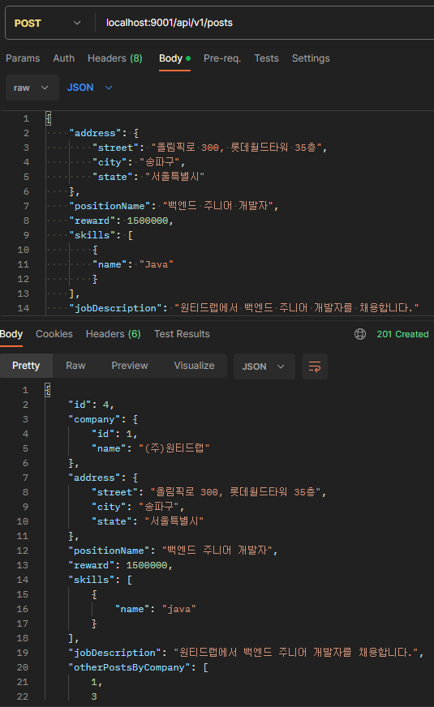
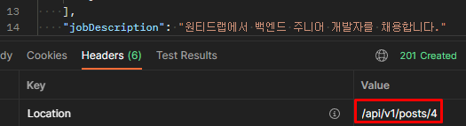
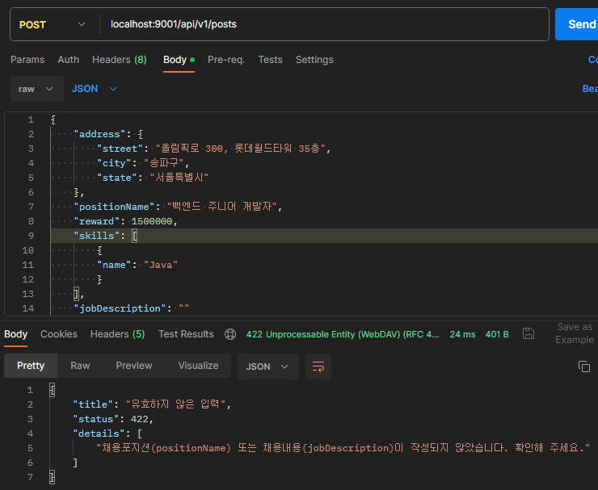

# 채용공고(post) 등록 기능 구현

## 채용공고 등록 관련 저장소(Repository) 테스트 작성 및 구현

### 테스트 작성

채용공고를 저장하고, 다시 불러와서 데이터가 일치하는지 테스트합니다.

```java
@DataJpaTest
@AutoConfigureTestDatabase(replace = AutoConfigureTestDatabase.Replace.NONE)
@Import(DataConfig.class)
@ActiveProfiles("integration")
@TestInstance(TestInstance.Lifecycle.PER_CLASS)
public class CreatePostRepositoryTest {

    @Autowired
    PostRepository postRepository;

    @Autowired
    CompanyRepository companyRepository;

    @Autowired
    SkillRepository skillRepository;

    @Autowired
    PositionSkillRepository positionSkillRepository;

    @Autowired
    AddressRepository addressRepository;

    @Test
    void savePost() {
        postRepository.deleteAll();
        positionSkillRepository.deleteAll();

        String positionName = "백엔드 주니어 개발자";
        String jobDescription = "원티드랩에서 백엔드 주니어 개발자를 채용합니다. 자격요건은 java, ...";
        Long reward = 1500000L;
        Company company = companyRepository.findById(1L).get();

        var post = Post.builder()
                .positionName(positionName)
                .jobDescription(jobDescription)
                .reward(reward)
                .company(company)
                .build();

        var returnedPost = postRepository.save(post);
        var skill = skillRepository.findByName("java").get();
        var returnedPositionSkills = positionSkillRepository.saveAll(Set.of(new PositionSkill(returnedPost, skill)));

        String streetAddress = "올림픽로 300, 롯데월드타워 35층";
        String cityAddress = "송파구";
        String stateAddress = "서울특별시";
        Address address = Address.builder()
                .post(returnedPost).street(streetAddress).city(cityAddress).state(stateAddress)
                .build();
        var returnedAddress = addressRepository.save(address);

        var newPost = postRepository.findById(returnedPost.getId()).get();
        assertThat(newPost.getPositionName()).isEqualTo(positionName);
        assertThat(newPost.getJobDescription()).isEqualTo(jobDescription);
        assertThat(newPost.getReward()).isEqualTo(reward);
        assertThat(newPost.getCompany().getId()).isEqualTo(1L);
        assertThat(returnedAddress.getPostId()).isEqualTo(returnedPost.getId());
        assertThat(returnedAddress.getStreet()).isEqualTo(streetAddress);
        assertThat(returnedAddress.getCity()).isEqualTo(cityAddress);
        assertThat(returnedAddress.getState()).isEqualTo(stateAddress);
        assertThat(returnedPositionSkills).hasSize(1);

    }

}
```

### 구현

추가로 필요한 Repository를 구현합니다.

```java
public interface AddressRepository extends JpaRepository<Address, Long> {
}

public interface CompanyRepository extends JpaRepository<Company, Long> {
}
```

## 채용공고 등록 관련 서비스(Service) 테스트 작성 및 구현

### 테스트 작성

채용공고라는 하나의 개념안에 여러 클래스로 나뉘다보니 테스트가 길어집니다. 이게 맞는건가 의문이들기 시작합니다.

```java
@Test
void savePostAndReturnPost() {

    var positionName = "백엔드 주니어 개발자";
    var jobDescription = "원티드랩에서 백엔드 주니어 개발자를 채용합니다. 자격요건은 java, ...";
    var reward = 1500000L;
    var company = Company.builder().id(1L).name("(주)원티드랩").build();
    var skill = new Skill(1L, "java");
    var streetAddress = "올림픽로 300, 롯데월드타워 35층";
    var cityAddress = "송파구";
    var stateAddress = "서울특별시";
    var address = Address.builder()
            .street(streetAddress).city(cityAddress).state(stateAddress)
            .build();

    var post = Post.builder()
            .positionName(positionName)
            .jobDescription(jobDescription)
            .reward(reward)
            .company(company)
            .address(address)
            .build();

    var savedPost = Post.builder()
            .id(1L)
            .positionName(positionName)
            .jobDescription(jobDescription)
            .reward(reward)
            .company(company)
            .build();

    var addressWithSavedPost = Address.builder()
            .post(savedPost).street(streetAddress).city(cityAddress).state(stateAddress)
            .build();

    var returnedAddress = Address.builder().postId(1L)
            .post(savedPost).street(streetAddress).city(cityAddress).state(stateAddress)
            .build();

    var positionSkill = new PositionSkill();
    positionSkill.setPost(savedPost);
    positionSkill.setSkill(skill);

    var returnedPositionSkill = new PositionSkill();
    returnedPositionSkill.setPost(savedPost);
    returnedPositionSkill.setSkill(skill);
    returnedPositionSkill.setIds(new PositionSkillKey(savedPost.getId(), skill.getId()));

    var expectedPost = Post.builder()
            .id(1L)
            .positionName(positionName)
            .jobDescription(jobDescription)
            .reward(reward)
            .company(company)
            .address(returnedAddress)
            .positionSkills(Set.of(returnedPositionSkill))
            .build();

    when(postRepository.save(post)).thenReturn(savedPost);
    when(addressRepository.save(addressWithSavedPost)).thenReturn(returnedAddress);
    when(positionSkillRepository.saveAll(Set.of(positionSkill))).thenReturn(List.of(returnedPositionSkill));

    var returnedPost = postService.createPost(post, List.of(skill));

    assertThat(returnedPost.getId()).isEqualTo(expectedPost.getId());
    assertThat(returnedPost.getPositionName()).isEqualTo(expectedPost.getPositionName());
    assertThat(returnedPost.getCompany().getId()).isEqualTo(expectedPost.getCompany().getId());
    assertThat(returnedPost.getCompany().getName()).isEqualTo(expectedPost.getCompany().getName());
    assertThat(returnedPost.getAddress().getPostId()).isEqualTo(expectedPost.getAddress().getPostId());
    assertThat(returnedPost.getAddress().getStreet()).isEqualTo(expectedPost.getAddress().getStreet());
    assertThat(returnedPost.getAddress().getCity()).isEqualTo(expectedPost.getAddress().getCity());
    assertThat(returnedPost.getAddress().getState()).isEqualTo(expectedPost.getAddress().getState());
    assertThat(returnedPost.getJobDescription()).isEqualTo(expectedPost.getJobDescription());
    assertThat(returnedPost.getPositionSkills().size()).isEqualTo(expectedPost.getPositionSkills().size());
    assertThat(returnedPost.getPositionSkills().contains(returnedPositionSkill)).isEqualTo(true);
}
```

### 구현

```java
@Transactional
public Post createPost(Post post, List<Skill> skills) {
    return savePost(post, skills);
}

private Post savePost(Post post, List<Skill> skills) {
    var address = post.getAddress();
    var savedPost = savePost(post);
    savedPost.setAddress(saveAddress(savedPost, address));
    savedPost.setPositionSkills(savePositionSkills(savedPost, skills));
    return savedPost;
}

private Post savePost(Post post) {
    post.setAddress(null);
    return postRepository.save(post);
}

private Address saveAddress(Address address, Post savedPost) {
    address.setPost(savedPost);
    return addressRepository.save(address);
}

private Set<PositionSkill> savePositionSkills(Post post, List<Skill> skills) {
    Set<PositionSkill> positionSkills = new HashSet<>();
    for (var skill : skills) {
        positionSkills.add(new PositionSkill(post, skill));
    }
    var returnedPositionSkill = positionSkillRepository.saveAll(positionSkills);
    positionSkills.clear();
    positionSkills.addAll(returnedPositionSkill);
    return positionSkills;
}
```

## 채용공고 등록 관련 컨트롤러(Controller) 테스트 작성 및 구현

### 컨트롤러 테스트 작성

#### 200(OK)

채용공고 등록 및 등록된 채용공고를 정상적으로 반환하는 경우에 대한 테스트를 작성합니다.

```java
@Test
void requestCreatePostAndReturnSavedPost() throws Exception {

    var body = """
            {
               "address": {
                 "street": "올림픽로 300, 롯데월드타워 35층",
                 "city": "송파구",
                 "state": "서울특별시"
               },
               "positionName": "백엔드 주니어 개발자",
               "reward": 1500000,
               "skills": [
                 {
                   "name": "Java"
                 }
               ],
               "jobDescription": "원티드랩에서 백엔드 주니어 개발자를 채용합니다."
            }
            """;

    var savePost = Post.builder()
            .company(Company.builder().id(1L).name("(주)원티드랩").build())
            .address(Address.builder().street("올림픽로 300, 롯데월드타워 35층").city("송파구").state("서울특별시").build())
            .positionName("주니어 백엔드 개발자")
            .jobDescription("원티드랩에서 백엔드 주니어 개발자를 채용합니다.")
            .reward(1500000L)
            .build();
    var skill = new Skill(1L, "java");
    var returnedPost = Post.builder()
            .id(5L)
            .company(Company.builder().id(1L).name("(주)원티드랩").build())
            .address(Address.builder().street("올림픽로 300, 롯데월드타워 35층").city("송파구").state("서울특별시").build())
            .positionName("주니어 백엔드 개발자")
            .jobDescription("원티드랩에서 백엔드 주니어 개발자를 채용합니다.")
            .reward(1500000L)
            .positionSkills(Set.of(new PositionSkill(Post.builder().id(5L).build(), skill)))
            .build();

    List<Long> otherPosts = new ArrayList<>();
    otherPosts.add(1L);
    otherPosts.add(2L);
    otherPosts.add(5L);

    given(skillService.getSkillByName(any())).willReturn(skill);
    given(postService.createPost(savePost, List.of(skill))).willReturn(returnedPost);
    given(postService.getPostIdsByCompanyId(1L)).willReturn(otherPosts);


    mockMvc.perform(post("/api/v1/posts")
                    .contentType(MediaType.APPLICATION_JSON)
                    .content(body))
            .andExpect(status().isCreated())
            .andExpect(header().exists("Location"))
            .andExpect(content().string(containsString("(주)원티드랩")))
            .andExpect(content().string(containsString("채용합니다")))
            .andExpect(jsonPath("$.['otherPostsByCompany'][2]").doesNotExist());

}
```

#### 422(Unprocessable Entity)

채용공고 등록 시 입력된 정보가 유효성 검사를 통과하지 못한 경우에 대한 테스트를 작성합니다.

```java
@Test
void requestCreatePostAndReturn422() throws Exception {

    var bodyWithEmptyPositionName = """
            {
               "address": {
                 "street": "올림픽로 300, 롯데월드타워 35층",
                 "city": "송파구",
                 "state": "서울특별시"
               },
               "positionName": "",
               "reward": 1500000,
               "skills": [
                 {
                   "name": "Java"
                 }
               ],
               "jobDescription": "원티드랩에서 백엔드 주니어 개발자를 채용합니다."
            }
            """;

    mockMvc.perform(post("/api/v1/posts")
                    .contentType(MediaType.APPLICATION_JSON)
                    .content(bodyWithEmptyPositionName))
            .andExpect(status().isUnprocessableEntity());
}
```

### JsonTest

기존에 설계한 요청과 응답에 대한 Json을 살펴보겠습니다.

#### Request Json

채용공고 생성 요청 시에는 기존의 PostView 를 사용하여 데이터를 받을 수 있습니다.

```json
{
  "address": {
    "street": "올림픽로 300, 롯데월드타워 35층",
    "city": "송파구",
    "state": "서울특별시"
  },
  "positionName": "백엔드 주니어 개발자",
  "reward": 1500000,
  "skills": [
    {
      "name": "Java"
    }
  ],
  "jobDescription": "원티드랩에서 백엔드 주니어 개발자를 채용합니다."
}
```

#### Response Json

채용공고 상세내용을 응답으로 반환하기 위해서는 추가적으로 jobDescription과 otherPostsByCompany 속성도 필요합니다.

```json
{
  "id": 77,
  "company": {
    "id": 1,
    "name": "(주)원티드랩"
  },
  "address": {
    "street": "올림픽로 300, 롯데월드타워 35층",
    "city": "송파구",
    "state": "서울특별시"
  },
  "positionName": "백엔드 주니어 개발자",
  "reward": 1500000,
  "skills": [
    {
      "name": "Java"
    }
  ],
  "jobDescription": "원티드랩에서 백엔드 주니어 개발자를 채용합니다.",
  "otherPostsByCompany": [
    11,
    23,
    44,
    64
  ]
}
```

#### PostView 수정

View Object인 PostView를 다음과 같이 채용공고의 세부적인 내용을 저장할 수 있도록 수정합니다. 그리고 Mapper 등 기존의 인스턴스를 만드는 곳에서는 postListOf 스태틱 메서드를 통해 인스턴스를 생성하도록 수정합니다.

```java
package com.limvik.backend.dto;

import com.fasterxml.jackson.annotation.JsonInclude;
import static com.fasterxml.jackson.annotation.JsonInclude.*;

public record PostView(
        Long id,
        CompanyView company,
        AddressView address,
        String positionName,
        Long reward,
        SkillView[] skills,
        @JsonInclude(Include.NON_EMPTY)
        String jobDescription,
        @JsonInclude(Include.NON_EMPTY)
        Long[] otherPostsByCompany
) {
    public static PostView postListOf(Long id,
                                      CompanyView company,
                                      AddressView address,
                                      String positionName,
                                      Long reward,
                                      SkillView[] skills) {
        return new PostView(id, company, address, positionName, reward, skills, null, null);
    }
}
```

#### 테스트 작성

추가된 정보에 대한 Serialization 테스트와 Deserialization 테스트를 수행합니다. 아래 코드는 기존의 PostView와 동일한 테스트 내용을 생략하였습니다.

```java
@BeforeAll
static void init() {
    postDetails = new PostView(
            77L,
            new CompanyView(1L, "(주)원티드랩"),
            new AddressView("올림픽로 300, 롯데월드타워 35층", "송파구", "서울특별시"),
            "백엔드 주니어 개발자",
            1500000L,
            new SkillView[]{new SkillView("Java")},
            "원티드랩에서 백엔드 주니어 개발자를 채용합니다.",
            new Long[]{11L, 23L, 44L, 64L}
    );
}

@Test
void postDetailsSerializationTest() throws IOException {
    assertThat(json.write(postDetails)).isStrictlyEqualToJson("postDetails.json");
    // 생략...
    assertThat(json.write(postDetails)).hasJsonPathStringValue("@.jobDescription");
    assertThat(json.write(postDetails)).extractingJsonPathStringValue("@.jobDescription", "원티드랩에서 백엔드 주니어 개발자를 채용합니다.");
    assertThat(json.write(postDetails)).hasJsonPathArrayValue("@.otherPostsByCompany");
    assertThat(json.write(postDetails)).extractingJsonPathValue("@.otherPostsByCompany[0]").isEqualTo(11);
}

@Test
void postDetailsDeserializationTest() throws IOException {
    String expected = // 응답 Json 생략...

    // 생략...
    assertThat(json.parseObject(expected).jobDescription()).isEqualTo("원티드랩에서 백엔드 주니어 개발자를 채용합니다.");
    assertThat(json.parseObject(expected).otherPostsByCompany().length).isEqualTo(4);
    assertThat(json.parseObject(expected).otherPostsByCompany()[0]).isEqualTo(11);
}
```

### 구현

#### Controller

`/api/v1/posts` 엔드포인트로 들어오는 Post 요청을 처리하는 로직을 작성합니다. Mapper는 생략합니다.

```java
@PostMapping
public ResponseEntity<PostView> returnCreatedPost(@RequestBody PostView createRequestedPost) {
    validateRequestedPost(createRequestedPost);
    var savedPost = mapPostDetailViewToPost(createRequestedPost);
    var returnedPost = mapPostToPostView().map(savedPost);
    return ResponseEntity.created(URI.create("/api/v1/posts/" + returnedPost.id())).body(returnedPost);
}

private void validateRequestedPost(PostView postView) {
    if (!StringUtils.hasText(postView.positionName()) || !StringUtils.hasText(postView.jobDescription()))
        throw new PostNotValidException();
}
```

#### Exception

채용포지션(positionName) 또는 채용내용(jobDescription)이 누락된 경우 발생시킬 예외를 정의합니다.

```java
package com.limvik.backend.exception;

public class PostNotValidException extends RuntimeException {

    public PostNotValidException() {
        super("채용포지션(positionName) 또는 채용내용(jobDescription)이 작성되지 않았습니다. 확인해 주세요.");
    }

}
```

#### ExceptionAdvice

특정 예외 발생 시 응답을 작성합니다.

```java
@RestControllerAdvice
public class PostControllerAdvice {

    @ExceptionHandler(PostNotValidException.class)
    @ResponseStatus(HttpStatus.UNPROCESSABLE_ENTITY)
    public Problem postNotValidHandler(PostNotValidException ex) {
        String message = ex.getMessage();
        return new Problem("유효하지 않은 입력", 422, new String[]{message});
    }
    
}
```

API 설계 시의 양식을 만들기 위해 Problem 클래스를 만들었습니다.

```java
public record Problem(
        String title,
        Integer status,
        String[] details
) {
}
```

### Manual Test

#### 201(Created)

정상 요청 시 같은 기업의 채용공고 id와 함께 응답을 반환하는 것을 확인할 수 있습니다.



또한 Location Header에 경로를 제공합니다.



#### 422(Unprocessable Entity)

예시로 채용내용(jobDescription)을 비우고 보내면, 아래와 같은 응답을 받을 수 있습니다.



### 가장 삽질한 부분

테스트 작성 시 처음 사용해보는 라이브러리를 많이 사용하고 있다보니, 테스트 작성하면서 삽질을 많이하게 됩니다.

아래와 같이 Mockito를 이용하였을 때, willReturn에 특정 객체를 지정했음에도 계속해서 null이 반환돼서 시간을 많이 보냈습니다.

```java
given(skillService.getSkillByName("java")).willReturn(skill);
```

원인을 찾지는 못했지만, 동일한 현상에서 any()로 해결한 분의 글([링크](https://jungguji.github.io/2020/06/09/BDDMockito-given-%EC%82%AC%EC%9A%A9%EC%8B%9C-%EC%A3%BC%EC%9D%98/))을 찾아서 해결하였습니다.

```java
given(skillService.getSkillByName(any())).willReturn(skill);
```

그래도 삽질하다가 jsonPath로 json 테스트하는 것을 알게돼서([글 링크](https://ykh6242.tistory.com/entry/MockMvc%EB%A5%BC-%EC%9D%B4%EC%9A%A9%ED%95%9C-REST-API%EC%9D%98-Json-Response-%EA%B2%80%EC%A6%9D)) 다음 테스트 작성 시에 적극적으로 적용해보겠습니다.

```java
.andExpect(jsonPath("$.['otherPostsByCompany'][2]").doesNotExist());
```
