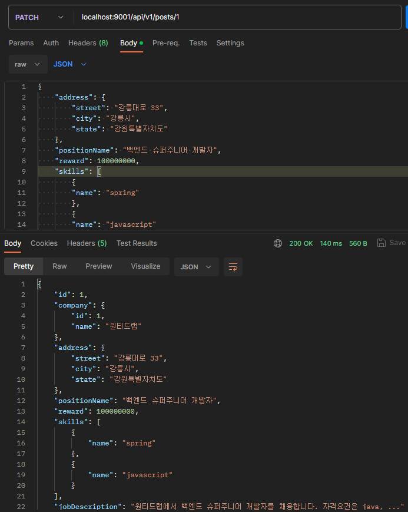
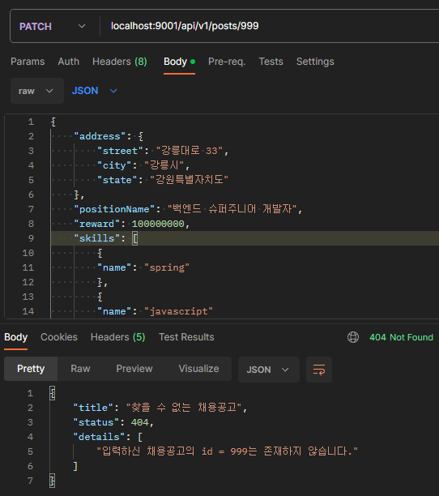
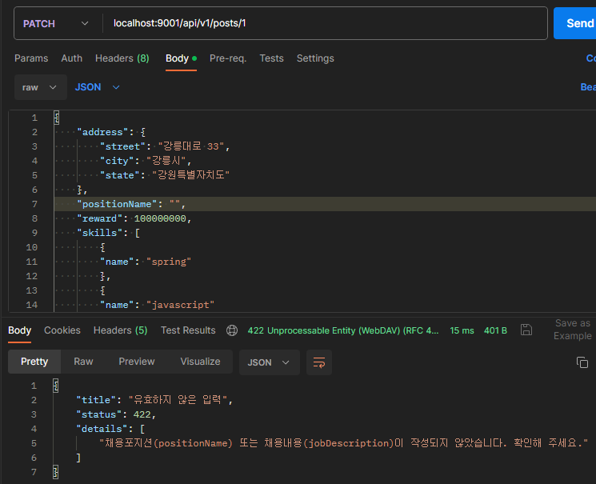

# 채용공고(post) 수정 기능 구현

## 채용공고 수정 관련 저장소(Repository) 테스트 작성 및 구현

### 테스트 작성

저장소에서는 채용공고 등록할 때와 크게 달라지는 점은 없습니다. 기존의 데이터를 수정한 후 정상적으로 수정된 내용이 반환되는지 확인하는 테스트를 작성합니다.

```java
@Test
void modifyPost() {

    String positionName = "백엔드 슈퍼주니어 개발자";
    String jobDescription = "원티드랩에서 백엔드 슈퍼주니어 개발자를 채용합니다. 자격요건은 java, ...";
    Long reward = 1000000000L;
    Company company = companyRepository.findById(1L).get();
    String streetAddress = "강릉대로 33";
    String cityAddress = "강릉시";
    String stateAddress = "강원특별자치도";
    var dummyPost = Post.builder().id(1L).build();
    Address address = Address.builder()
            .postId(1L).street(streetAddress).city(cityAddress).state(stateAddress)
            .build();
    var skill1 = skillRepository.findByName("spring").get();
    var skill2 = skillRepository.findByName("react").get();
    var positionSkills = new HashSet<PositionSkill>();
    positionSkills.add(new PositionSkill(dummyPost, skill1));
    positionSkills.add(new PositionSkill(dummyPost, skill2));
    var skillIds = positionSkillRepository.findSkillIdByPostId(1L);
    positionSkills.removeIf(positionSkill ->
            skillIds.contains(positionSkill.getSkill().getId()));

    var post = Post.builder()
            .id(1L)
            .positionName(positionName)
            .jobDescription(jobDescription)
            .reward(reward)
            .company(company)
            .address(address)
            .positionSkills(positionSkills)
            .build();

    var returnedPost = postRepository.save(post);

    var newPost = postRepository.findById(returnedPost.getId()).get();
    newPost.setPositionSkills(positionSkillRepository.findAllByPostId(1L));
    assertThat(newPost.getId()).isEqualTo(1L);
    assertThat(newPost.getPositionName()).isEqualTo(positionName);
    assertThat(newPost.getJobDescription()).isEqualTo(jobDescription);
    assertThat(newPost.getReward()).isEqualTo(reward);
    assertThat(newPost.getCompany().getId()).isEqualTo(company.getId());
    assertThat(newPost.getAddress().getPostId()).isEqualTo(address.getPostId());
    assertThat(newPost.getAddress().getStreet()).isEqualTo(streetAddress);
    assertThat(newPost.getAddress().getCity()).isEqualTo(cityAddress);
    assertThat(newPost.getAddress().getState()).isEqualTo(stateAddress);
    assertThat(newPost.getPositionSkills()).hasSize(2);

}
```
Post 객체에 PositionSkills의 Fetch Mode를 EAGER로 설정했음에도, 한 번에 불러오지 않아서 채용공고를 불러온 후 PositionSkills를 다시 불러오도록 임시로 설정하였습니다. 해결방법이 쉽게 보이지 않아 기한 전에 기능을 마무리하면 해결방법을 찾아봐야겠습니다.

### 구현

해결방법을 찾기 전 사용하기 위한 메서드를 추가하였습니다.

```java
@Query("SELECT p.ids.skillId FROM PositionSkill p WHERE p.ids.postId = :id")
Set<Long> findSkillIdByPostId(@Param("id") Long id);

Set<PositionSkill> findAllByPostId(Long postId);
```

### 수정

PositionSkill을 앞서 1개만 다뤘더니, 중복 문제가 발생하는 것을 눈치채지 못했습니다.

이전에 PositionSkill의 @EqualsAndHashCode는 ids만 지정을 했었는데, 동등비교를 하려면 PositionSkill 객체를 만들 때 PositionSkillKey 객체를 따로 만들어야 하지만, 동등 비교를 위해 객체를 따로 만드는 것은 비효율적입니다. 또한 저장할때는 ids 상관없이 post와 skill 객체에서 id 값을 참조하기 때문에 post와 skill로 변경하였습니다.

```java
@EqualsAndHashCode(of = {"post", "skill"})
@Getter
@Setter
@AllArgsConstructor
@NoArgsConstructor
@Entity
@Table(name = "position_skills")
public class PositionSkill {

    @EmbeddedId
    private PositionSkillKey ids = new PositionSkillKey();

    @ManyToOne
    @MapsId("postId")
    @JoinColumn(name = "post_id")
    private Post post;

    @ManyToOne
    @MapsId("skillId")
    @JoinColumn(name = "skill_id")
    private Skill skill;

    public PositionSkill(Post post, Skill skill) {
        this.post = post;
        this.skill = skill;
    }
}
```

## 채용공고 수정 관련 서비스(Service) 테스트 작성 및 구현

### 테스트 작성

#### 존재하는 id, 정상적인 수정 요청

존재하는 채용공고 id를 지정하여, 정상적인 수정 요청을 받았을 경우 수정된 채용공고를 반환하는 테스트를 작성합니다.

```java
@Test
void modifyPostAndReturnPost() {

    var targetPostId = 1L;
    var dummyPost = Post.builder().id(targetPostId).build();
    var positionName = "백엔드 슈퍼주니어 개발자";
    var jobDescription = "원티드랩에서 백엔드 슈퍼주니어 개발자를 채용합니다. 자격요건은 java, ...";
    var reward = 100000000L;
    var targetCompanyId = 1L;
    var targetCompanyName = "(주)원티드랩";
    var company = Company.builder().id(targetCompanyId).name(targetCompanyName).build();
    var skill1 = new Skill(2L, "spring");
    var skill2 = new Skill(3L, "javascript");
    var modifiedSkills = Set.of(new PositionSkill(dummyPost, skill1), new PositionSkill(dummyPost, skill2));
    var streetAddress = "강릉대로 33";
    var cityAddress = "강릉시";
    var stateAddress = "강원특별자치도";
    var address = Address.builder()
            .postId(targetPostId).street(streetAddress).city(cityAddress).state(stateAddress)
            .build();

    var modifiedPost = Post.builder()
            .id(targetPostId)
            .positionName(positionName)
            .jobDescription(jobDescription)
            .reward(reward)
            .company(company)
            .address(address)
            .positionSkills(modifiedSkills)
            .build();
    when(postRepository.findById(any())).thenReturn(Optional.of(modifiedPost));
    when(postRepository.save(modifiedPost)).thenReturn(modifiedPost);
    when(positionSkillRepository.findAllByPostId(modifiedPost.getId())).thenReturn(modifiedSkills);

    var returnedPost = postService.modifyPost(modifiedPost, List.of(skill1, skill2));
    assertAll("post",
            () -> assertAll("contents",
                    () -> assertThat(returnedPost.getId()).isEqualTo(targetPostId),
                    () -> assertThat(returnedPost.getJobDescription()).isEqualTo(jobDescription),
                    () -> assertThat(returnedPost.getPositionName()).isEqualTo(positionName)),
            () -> assertAll("company",
                    () -> assertThat(returnedPost.getCompany().getId()).isEqualTo(targetCompanyId),
                    () -> assertThat(returnedPost.getCompany().getName()).isEqualTo(targetCompanyName)),
            () -> assertAll("address",
                    () -> assertThat(returnedPost.getAddress().getPostId()).isEqualTo(targetPostId),
                    () -> assertThat(returnedPost.getAddress().getStreet()).isEqualTo(streetAddress),
                    () -> assertThat(returnedPost.getAddress().getCity()).isEqualTo(cityAddress),
                    () -> assertThat(returnedPost.getAddress().getState()).isEqualTo(stateAddress)),
            () -> assertAll("positionSkills",
                    () -> assertThat(returnedPost.getPositionSkills().size())
                            .isEqualTo(modifiedPost.getPositionSkills().size()),
                    () -> assertThat(returnedPost.getPositionSkills().containsAll(modifiedSkills))
                            .isEqualTo(true)));

}
```

#### 존재하지 않는 id로 수정요청

존재하지 않는 id로 수정 요청하는 경우 서비스에서 처리하는 테스트를 작성합니다.

```java
@Test
void modifyNonExistPostAndThrowException() {
    var targetPostId = 99L;
    var post = Post.builder().id(targetPostId).build();
    var skill = new Skill(2L, "spring");

    when(postRepository.findById(any())).thenReturn(Optional.empty());

    assertThatThrownBy(() -> postService.modifyPost(post, List.of(skill)))
            .isInstanceOf(PostNotFoundException.class)
            .hasMessage("입력하신 채용공고의 id = " + post.getId() + "는 존재하지 않습니다.");
}
```

### 구현

#### Exception

앞서 테스트에 작성한 Exception 을 추가합니다.

```java
public class PostNotFoundException extends RuntimeException {

    public PostNotFoundException(Long postId) {
        super("입력하신 채용공고의 id = " + postId + "는 존재하지 않습니다.");
    }
}
```

#### Service

채용공고 id 존재여부 확인 후 존재하지 않는 id면 예외를 던지고, 아니면 수정된 채용공고 내용을 저장합니다.

```java
@Transactional
public Post modifyPost(Post post, List<Skill> skills) {
    postRepository.findById(post.getId()).orElseThrow(() -> new PostNotFoundException(post.getId()));
    var positionSkills = getPositionSkills(post, skills);
    var existSkillIds = positionSkillRepository.findSkillIdByPostId(post.getId());
    positionSkills.removeIf(positionSkill ->
            existSkillIds.contains(positionSkill.getSkill().getId()));
    post.setPositionSkills(positionSkills);
    post.getAddress().setPostId(post.getId());
    var modifiedPost = postRepository.save(post);
    modifiedPost.setPositionSkills(positionSkillRepository.findAllByPostId(modifiedPost.getId()));
    return modifiedPost;
}

private Set<PositionSkill> getPositionSkills(Post post, List<Skill> skills) {
    Set<PositionSkill> positionSkills = new HashSet<>();
    for (var skill : skills) {
        positionSkills.add(new PositionSkill(post, skill));
    }
    return positionSkills;
}
```

## 채용공고 수정 관련 컨트롤러(Controller) 테스트 작성 및 구현

수정 요청 시 수정성공(200), 존재하지 않는 id(404), 유효하지 않은 수정(422) 응답에 대한 테스트를 작성합니다.

### 200(OK)

정상적으로 수정요청을 하여 수정된 내용을 저장하고, 클라이언트에 수정된 내용을 반환하는 테스트를 작성합니다.

```java
String body;

@BeforeEach
void setUp() {
    body = """
            {
               "address": {
                 "street": "강릉대로 33",
                 "city": "강릉시",
                 "state": "강원특별자치도"
               },
               "positionName": "백엔드 슈퍼주니어 개발자",
               "reward": 100000000,
               "skills": [
                 {
                   "name": "spring"
                 },
                 {
                   "name": "javascript"
                 }
               ],
               "jobDescription": "원티드랩에서 백엔드 슈퍼주니어 개발자를 채용합니다. 자격요건은 java, ..."
            }
            """;
}

@Test
void requestModifyPostAndReturnModifiedPost() throws Exception {

    var targetPostId = 1L;
    var dummyPost = Post.builder().id(targetPostId).build();
    var positionName = "백엔드 슈퍼주니어 개발자";
    var jobDescription = "원티드랩에서 백엔드 슈퍼주니어 개발자를 채용합니다. 자격요건은 java, ...";
    var reward = 100000000L;
    var targetCompanyId = 1L;
    var targetCompanyName = "(주)원티드랩";
    var company = Company.builder().id(targetCompanyId).name(targetCompanyName).build();
    var skill1 = new Skill(2L, "spring");
    var skill2 = new Skill(3L, "javascript");
    var modifiedSkills = Set.of(new PositionSkill(dummyPost, skill1), new PositionSkill(dummyPost, skill2));
    var streetAddress = "강릉대로 33";
    var cityAddress = "강릉시";
    var stateAddress = "강원특별자치도";
    var address = Address.builder()
            .postId(targetPostId).street(streetAddress).city(cityAddress).state(stateAddress)
            .build();

    var modifyPost = Post.builder()
            .id(targetPostId)
            .company(company)
            .address(address)
            .positionName(positionName)
            .jobDescription(jobDescription)
            .reward(reward)
            .build();

    var returnedPost = Post.builder()
            .id(targetPostId)
            .company(company)
            .address(address)
            .positionName(positionName)
            .jobDescription(jobDescription)
            .reward(reward)
            .positionSkills(modifiedSkills)
            .build();

    List<Long> otherPosts = new ArrayList<>();
    otherPosts.add(1L);
    otherPosts.add(2L);
    otherPosts.add(5L);

    given(skillService.getSkillByName(skill1.getName())).willReturn(skill1);
    given(skillService.getSkillByName(skill2.getName())).willReturn(skill2);
    given(postService.modifyPost(modifyPost, List.of(skill1, skill2))).willReturn(returnedPost);
    given(skillService.getSkillsByPosition(returnedPost.getPositionSkills())).willReturn(List.of(skill1, skill2));
    given(postService.getPostIdsByCompanyId(targetCompanyId)).willReturn(otherPosts);

    mockMvc.perform(patch("/api/v1/posts/" + targetPostId)
                    .contentType(MediaType.APPLICATION_JSON)
                    .content(body))
            .andExpect(status().isOk())
            .andExpect(header().doesNotExist("Location"))
            .andExpect(content().string(containsString(positionName)))
            .andExpect(content().string(containsString(cityAddress)))
            .andExpect(jsonPath("$.['skills'].length()").value(2))
            .andExpect(jsonPath("$.['otherPostsByCompany'][2]").doesNotExist());

}
```

### 404(Not Found)

존재하지 않는 id에 대한 수정을 요청하는 경우 service에서 PostNotFoundException 이 던져지고, 404를 반환하는 테스트를 작성합니다.

```java
@Test
void requestModifyPostAndReturn404NotFound() throws Exception {

    var targetPostId = 9999L;
    given(postService.modifyPost(any(), any())).willThrow(new PostNotFoundException(targetPostId));

    mockMvc.perform(patch("/api/v1/posts/" + targetPostId)
                    .contentType(MediaType.APPLICATION_JSON)
                    .content(body))
            .andExpect(status().isNotFound())
            .andExpect(content().string(containsString("입력하신 채용공고의 id = " + targetPostId + "는 존재하지 않습니다.")));
}
```

### 422(Unprocessable Entity)

채용공고 생성할 때와 마찬가지로 유효하지 않은 입력에 대해 422를 반환하는 테스트를 작성합니다. 같은 로직을 사용하므로 큰 의미가 없는 테스트인 것 같아서 이번에는 채용내용을 비웁니다.

```java
@Test
void requestModifyPostAndReturn422UnprocessableEntity() throws Exception {

    var bodyWithEmptyPositionName = """
            {
               "address": {
                 "street": "강릉대로 33",
                 "city": "강원도",
                 "state": "강원특별자치도"
               },
               "positionName": "백엔드 슈퍼주니어 개발자",
               "reward": 1500000,
               "skills": [
                 {
                   "name": "Java"
                 }
               ],
               "jobDescription": ""
            }
            """;

    mockMvc.perform(patch("/api/v1/posts/1")
                    .contentType(MediaType.APPLICATION_JSON)
                    .content(bodyWithEmptyPositionName))
            .andExpect(status().isUnprocessableEntity());

}
```

### 구현

#### Controller

patch 메서드를 받을 엔드포인트를 구현합니다.

```java
@PatchMapping("/{id}")
public ResponseEntity<PostView> returnModifiedPost(@PathVariable Long id,
                                                   @RequestBody PostView modifyRequestPost) {
    validateRequestedPost(modifyRequestPost);
    var modifiedPost = mapModifyPostDetailViewToPost(modifyRequestPost, id);
    var returnedPost = mapPostToPostView().map(modifiedPost);
    return ResponseEntity.ok(returnedPost);
}

private Post mapModifyPostDetailViewToPost(PostView postView, Long postId) {
    var post = mapPostViewToPost().map(postView);
    post.setId(postId);
    return postService.modifyPost(post, getSkills(postView));
}
```

#### ControllerAdvice

422에 대한 예외는 이미 구현했으므로, 404(Not Found)에 대한 예외처리를 작성합니다.

```java
@ExceptionHandler(PostNotFoundException.class)
@ResponseStatus(HttpStatus.NOT_FOUND)
public Problem postNotFoundHandler(PostNotFoundException ex) {
    String message = ex.getMessage();
    return new Problem("찾을 수 없는 채용공고", HttpStatus.NOT_FOUND.value(), new String[]{message});
}
```

### Manual Test

#### 200(OK)

수정 요청에 성공한 응답 화면입니다.



#### 404(NotFound)

존재하지 않는 id에 수정 요청한 응답 화면입니다.



#### 422(Unprocessable Entity)

채용포지션을 비워 유효하지 않은 수정 요청한 응답 화면입니다.



### 기타

- JPA가 아직 미숙해서 안될때 원인을 찾고 해결하는게 쉽지 않았습니다. 이번에는 EAGER로 설정한 관계 속성이 1개의 인스턴스만 불러와서 별도로 다시 데이터를 불러오는 작업을 해주게 됐습니다.
- Company Id 수정을 요청하면 Exception이 발생해야 하지만, 로그인 기능이 없어서 수정하는 사람을 식별할 수 없다보니 관련 사항을 고려하지 않았습니다. 로그인 기능을 추가한다면, 수정 요청한 회사의 Company ID와 공고의 Companay ID를 비교하여 예외를 발생시켜 처리하면 큰 어려움이 없을것으로 예상됩니다.