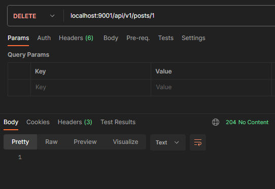
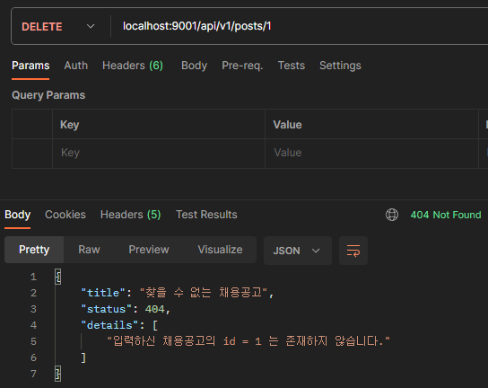

# 채용공고(post) 삭제 기능 구현

## 채용공고 삭제 관련 컨트롤러(Controller) 테스트 작성 및 구현

가장 하위 계층인 repository부터 하다보니 세부 구현을 우선하게 되어 계속 놓치는 부분이 생겼습니다. 그래서 이번에는 반대 방향으로 컨트롤러부터 시작합니다.

### 테스트 작성

#### 204(No Content)

정상적으로 채용공고가 삭제되었을 경우 204(No Content)를 반환하는 테스트를 작성합니다.

```java
@Test
void requestDeletePostAndReturn204WithNothing() throws Exception {

    var targetPostId = 1L;

    doAnswer(invocation -> null)
            .when(postService).deletePost(anyLong());

    mockMvc.perform(delete("/api/v1/posts/" + targetPostId))
            .andExpect(status().isNoContent());

}
```

#### 404(Not Found)

수정할 때와 마찬가지로 존재하지 않는 채용공고 id로 삭제 요청을 할 경우 404(Not Found)를 반환하는 테스트를 작성합니다.

```java
@Test
void requestDeletePostAndReturn404() throws Exception {

    var targetPostId = 999L;
    doThrow(new PostNotFoundException(targetPostId))
            .when(postService).deletePost(anyLong());

    mockMvc.perform(delete("/api/v1/posts/" + targetPostId))
            .andExpect(status().isNotFound())
            .andExpect(content().string(containsString("입력하신 채용공고의 id = " + targetPostId + "는 존재하지 않습니다.")));

}
```

### 구현

#### Controller

요청을 받아 처리할 수 있도록 컨트롤러를 구현합니다.

```java
@DeleteMapping("/{id}")
public ResponseEntity<Void> returnDeletePost(@PathVariable Long id) {
    postService.deletePost(id);
    return ResponseEntity.noContent().build();
}
```

#### Service

Service는 Mocking이 가능하도록 인터페이스만 구현합니다.

```java
@Transactional
public void deletePost(Long id) {

}
```

## 채용공고 삭제 관련 서비스(Service) 테스트 작성 및 구현

### 테스트 작성

정상일 경우 응답이 없으므로 특별히 테스트할게 없으므로, 존재하지 않는 id로 삭제 요청한 경우에 대한 테스트를 작성합니다.

```java
@Test
void modifyNonExistPostAndThrowException() {
    var targetPostId = 99L;

    when(postRepository.findById(targetPostId)).thenReturn(Optional.empty());

    assertThatThrownBy(() -> postService.deletePost(targetPostId))
            .isInstanceOf(PostNotFoundException.class)
            .hasMessage(new PostNotFoundException(targetPostId).getMessage());

}
```

하드코딩된 메시지를 매번 붙여넣기 불편해서 Exception을 수정하였습니다.

```java
public class PostNotFoundException extends RuntimeException {

    private static final String messageTemplate = "입력하신 채용공고의 id = %d 는 존재하지 않습니다.";

    public PostNotFoundException(Long postId) {
        super(messageTemplate.formatted(postId));
    }
}
```

### 구현

```java
@Transactional
public void deletePost(Long id) {
    postRepository.findById(id).orElseThrow(() -> new PostNotFoundException(id));
    postRepository.deleteById(id);
}
```

## 채용공고 삭제 관련 저장소(Repository) 테스트 작성 및 구현

### 테스트 작성

존재하는 채용공고를 삭제하고, 1개가 지워졌는지 확인하는 테스트를 작성합니다.

```java
@Test
void deletePost() {
    var targetPostId = 1L;
    assertThat(postRepository.findById(targetPostId).isPresent()).isTrue();
    
    var countTotalPosts = postRepository.count();
    postRepository.deleteById(targetPostId);
    assertThat(countTotalPosts - postRepository.count()).isEqualTo(1);
}
```

### 구현

Spring Data JPA를 통해 기본적으로 제공하는 Repository 메서드를 활용 가능하여, 특별히 구현할 사항은 없습니다.

### Manual Test

#### 204(No Content)

삭제에 성공한 경우 204(No Content)가 반환되며, body는 비어있는 것을 확인할 수 있습니다.



#### 404(Not Found)

앞서 삭제한 id 1을 대상으로 다시 삭제를 시도하면, 찾을 수 없다는 응답을 받을 수 있습니다.

