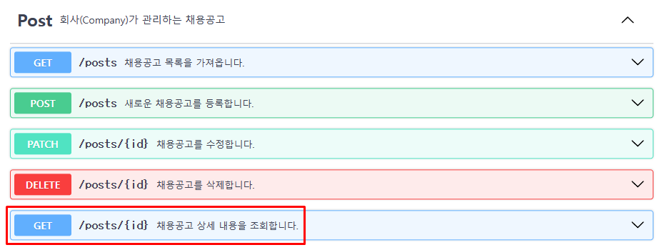
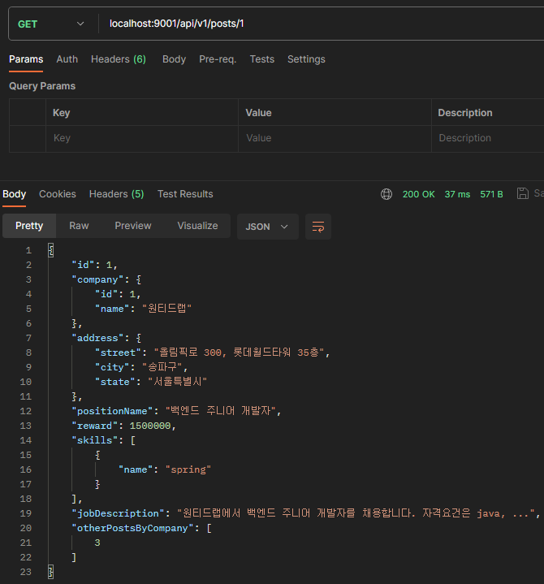
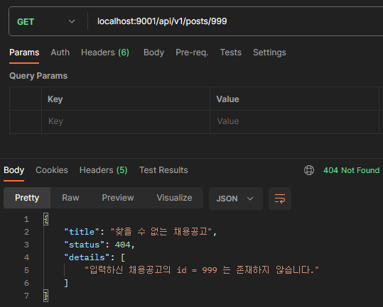

# 채용공고(post) 상세조회 기능 구현

## API 문서 수정

채용공고 상세조회 기능에 대한 API 문서가 누락되어 수정합니다.



## 채용공고 상세조회 관련 컨트롤러(Controller) 테스트 작성 및 구현

채용공고 id를 지정하여 GET 메서드로 요청하는 경우에 대한 테스트를 작성합니다.

### 테스트 작성

#### 200(OK)

채용공고 목록 조회 테스트 코드를 대부분 재사용할 수 있어서, content()에서 jsonPath 테스트로 변경하는 작업을 했습니다.

```java
@Test
void requestPostDetailsAndReturn200WithPostDetails() throws Exception {

    var targetPostId = 1L;
    var dummyPost = Post.builder().id(targetPostId).build();
    var positionName = "백엔드 주니어 개발자";
    var jobDescription = "원티드랩에서 백엔드 주니어 개발자를 채용합니다. 자격요건은 java, ...";
    var reward = 1500000L;
    var targetCompanyId = 1L;
    var targetCompanyName = "(주)원티드랩";
    var company = Company.builder().id(targetCompanyId).name(targetCompanyName).build();
    var skill1 = new Skill(2L, "spring");
    var skill2 = new Skill(3L, "javascript");
    var skills = Set.of(new PositionSkill(dummyPost, skill1), new PositionSkill(dummyPost, skill2));
    var streetAddress = "올림픽로 300, 롯데월드타워 35층";
    var cityAddress = "송파구";
    var stateAddress = "서울특별시";
    var address = Address.builder()
            .postId(targetPostId).street(streetAddress).city(cityAddress).state(stateAddress)
            .build();

    var returnedPost = Post.builder()
            .id(targetPostId)
            .company(company)
            .address(address)
            .positionName(positionName)
            .jobDescription(jobDescription)
            .reward(reward)
            .positionSkills(skills)
            .build();

    List<Long> otherPosts = new ArrayList<>();
    otherPosts.add(1L);
    otherPosts.add(2L);
    otherPosts.add(5L);

    given(postService.getPost(targetPostId)).willReturn(returnedPost);
    given(skillService.getSkillsByPosition(returnedPost.getPositionSkills())).willReturn(List.of(skill1, skill2));
    given(postService.getPostIdsByCompanyId(targetCompanyId)).willReturn(otherPosts);

    mockMvc.perform(get("/api/v1/posts/" + targetPostId))
            .andExpect(status().isOk())
            .andExpect(jsonPath("$.['company']['name']").value(targetCompanyName))
            .andExpect(jsonPath("$.['positionName']").value(positionName))
            .andExpect(jsonPath("$.['address']['street']").value(streetAddress))
            .andExpect(jsonPath("$.['skills'].length()").value(2))
            .andExpect(jsonPath("$.['otherPostsByCompany'][0]").value(2))
            .andExpect(jsonPath("$.['otherPostsByCompany'][1]").value(5));

}
```

#### 404(Not Found)

다른 엔드포인트의 404 테스트와 동일한 로직으로 작성 가능합니다.

```java
@Test
void requestPostDetailsAndReturn404NotFound() throws Exception {

    var targetPostId = 999L;

    given(postService.getPost(targetPostId)).willThrow(new PostNotFoundException(targetPostId));

    mockMvc.perform(get("/api/v1/posts/" + targetPostId))
            .andExpect(status().isNotFound())
            .andExpect(content().string(containsString(new PostNotFoundException(targetPostId).getMessage())));
}
```

### 구현

#### Controller

기존의 mapper를 이용한 구현이 가능합니다.

```java
@GetMapping("/{id}")
public ResponseEntity<PostView> returnPostDetails(@PathVariable Long id) {
    var postView = mapPostToPostView().map(postService.getPost(id));
    return ResponseEntity.ok(postView);
}
```

#### Service

Mocking을 위해 Service 에서 인터페이스를 만들어줍니다. 

```java
@Transactional(readOnly = true)
public Post getPost(Long id) {
    return null;
}
```

id로 찾거나 PostNotFoundException을 던지는 것은 여러 곳에서 공유 가능하므로, private 메서드로 만들어주었습니다.

## 채용공고 상세조회 관련 서비스(Service) 테스트 작성 및 구현

### 테스트 작성

#### 정상 요청 및 응답

repository에서 정상적으로 조회가 됐을 때 정상적인 응답 여부를 확인하는 테스트를 작성합니다.

기존의 테스트 코드가 활용되는 부분은 생략하였습니다.

```java
@Test
void getPostDetails() {

    // 생략

    when(postRepository.findById(targetPostId)).thenReturn(Optional.of(post));
    when(positionSkillRepository.findAllByPostId(targetPostId)).thenReturn(skills);

    var returnedPost = postService.getPost(targetPostId);

    assertAll("post",
            // 생략
            );
}
```

#### 존재하지 않는 id

이전의 존재하지 않는 채용공고 id로 요청했을 때와 동일한 로직의 테스트입니다.

```java
@Test
void getNonExistPostAndThrowException() {
    var targetPostId = 99L;

    when(postRepository.findById(targetPostId)).thenReturn(Optional.empty());

    assertThatThrownBy(() -> postService.getPost(targetPostId))
            .isInstanceOf(PostNotFoundException.class)
            .hasMessage(new PostNotFoundException(targetPostId).getMessage());
}
```

### 구현

findById 메서드를 호출하고, 예외를 던지는 코드는 여러곳에서 사용하므로, private 메서드로 분리하였습니다.

```java
@Transactional(readOnly = true)
public Post getPost(Long id) {
    var post = findPostById(id);
    post.setPositionSkills(positionSkillRepository.findAllByPostId(id));
    return post;
}

private Post findPostById(Long id) {
    return postRepository.findById(id).orElseThrow(() -> new PostNotFoundException(id));
}
```

## 채용공고 상세조회 관련 저장소(Repository) 테스트 작성

이미 다른 곳에서 다 테스트한 메서드인데 테스트를 작성하는게 맞는지에 대한 의문이 들지만, 판단할 지식이 부족하고 간단한 테스트이므로 형식적으로나마 작성합니다.

```java
@Test
void getPostDetails() {
    var targetPostId = 1L;
    assertThat(postRepository.findById(targetPostId).isPresent()).isTrue();
    assertThat(positionSkillRepository.findSkillIdByPostId(targetPostId).size()).isEqualTo(1);
}
```

## Manual Test

### 더미데이터 추가

동일한 회사의 다른 채용공고 id를 확인하기 위해 1개의 채용공고 더미데이터를 추가합니다.

```sql
INSERT INTO posts(position_name, job_description, reward, company_id) VALUES
('백엔드 주니어 개발자', '원티드랩에서 백엔드 주니어 개발자를 채용합니다. 자격요건은 java, ...', 1500000, 1),
('프론트 주니어 개발자', '사람인에서 프론트 주니어 개발자를 채용합니다. 자격요건은 react, ...', 1000000, 2),
('프론트 주니어 개발자', '원티드랩에서 프론트 주니어 개발자를 채용합니다. 자격요건은 javascript, ...', 1500000, 1);
```

### 200(OK)

채용공고의 상세 내용과 같은 회사의 다른 채용공고 id인 3이 포함되어 있는 것을 확인할 수 있습니다.



### 404(Not Found)

이전과 동일한 양식의 404 Not Found 응답을 확인할 수 있습니다.

