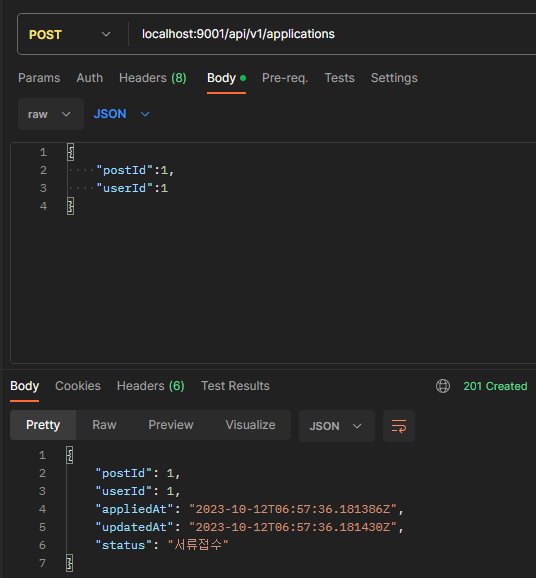
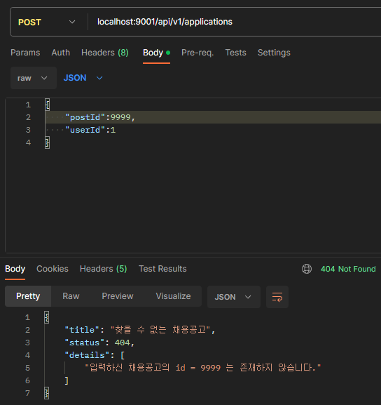
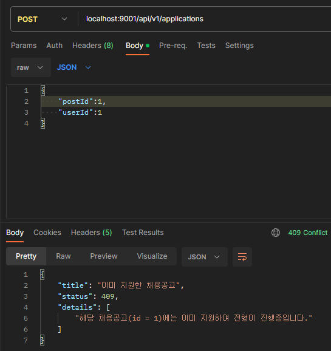

# 채용공고 지원(application) 기능 구현

## JsonTest

먼저 요청과 응답 시 사용할 View Object를 생성하고 Serialization 및 Deserialization 테스트를 수행합니다.

설계한 API의 요청과 응답을 보면, postId를 applicationId로 작성하여 혼란스럽습니다.

```java
// 요청
{
  "applicationId": 12,
  "userId": 42
}

// 응답
{
  "applicationId": 12,
  "userId": 42,
  "appliedAt": "2023-10-12T00:41:35.575Z",
  "updatedAt": "2023-10-12T00:41:35.575Z",
  "status": "서류접수"
}
```

applicationId는 postId로 정정하여 View Object를 생성합니다.

### AppicationView

```java
public record ApplicationView(
        Long postId,
        Long userId,
        @JsonInclude(JsonInclude.Include.NON_EMPTY)
        Instant appliedAt,
        @JsonInclude(JsonInclude.Include.NON_EMPTY)
        Instant updatedAt,
        @JsonInclude(JsonInclude.Include.NON_EMPTY)
        String status
) {
        public static ApplicationView applicationRequest(Long postId, Long userId) {
                return new ApplicationView(postId, userId, null, null, null);
        }
}
```

### 테스트 작성

요청은 Deserialization만 수행하고, 응답은 Serialization만 수행하므로, 각각에 대해 테스트를 작성합니다.

```java
@JsonTest
public class ApplicationJsonTest {

    @Autowired
    JacksonTester<ApplicationView> json;

    static ApplicationView request;
    static ApplicationView response;
    static Instant instant;

    @BeforeAll
    static void init() {
        
        request = ApplicationView.applicationRequest(12L, 42L);

        instant = Instant.parse("2023-10-12T00:41:35.575Z");
        response = new ApplicationView(12L, 42L,
                instant,
                instant,
                "서류접수");

    }

    @Test
    void applicationRequestDeserializationTest() throws IOException {
        var expected = """
                {
                  "postId": 12,
                  "userId": 42
                }
                """;

        assertThat(json.parseObject(expected).postId()).isEqualTo(12);
        assertThat(json.parseObject(expected).userId()).isEqualTo(42);
    }

    @Test
    void applicationResponseSerializationTest() throws IOException {
        assertThat(json.write(response)).isStrictlyEqualToJson("applicationResponse.json");
        assertThat(json.write(response)).extractingJsonPathNumberValue("@.postId").isEqualTo(12);
        assertThat(json.write(response)).extractingJsonPathNumberValue("@.userId").isEqualTo(42);
        assertThat(json.write(response)).extractingJsonPathStringValue("@.appliedAt").isEqualTo(instant.toString());
        assertThat(json.write(response)).extractingJsonPathStringValue("@.updatedAt").isEqualTo(instant.toString());
        assertThat(json.write(response)).extractingJsonPathStringValue("@.status").isEqualTo("서류접수");
    }
}
```

## 채용공고 지원(application) 관련 컨트롤러(Controller) 테스트 작성 및 구현

### 테스트 작성

#### 201(Created)

채용공고 식별자와 사용자 식별자를 받아 정상적으로 저장하고, 반환하는 테스트를 작성합니다.

```java
String body;

@BeforeEach
void init() {
    body = """
            {
              "postId": 12,
              "userId": 42
            }
            """;
}

@Test
void requestCreateApplicationAndReturnSavedApplication() throws Exception {

    var postId = 12L;
    var userId = 42L;
    var now = Instant.now();
    var statusName = "서류접수";
    var applicationKey = new ApplicationKey(postId, userId);

    var returnedApplication = Application.builder()
            .ids(applicationKey)
            .post(Post.builder().id(postId).build())
            .user(User.builder().id(userId).build())
            .status(Status.builder().id(1L).name(statusName).build())
            .appliedAt(now)
            .updatedAt(now)
            .build();

    given(applicationService.saveApplication(Application.builder().ids(applicationKey).build()))
            .willReturn(returnedApplication);

    mockMvc.perform(post("/api/v1/applications")
                    .contentType(MediaType.APPLICATION_JSON)
                    .content(body))
            .andExpect(status().isCreated())
            .andExpect(jsonPath("$.['postId']").value(postId))
            .andExpect(jsonPath("$.['userId']").value(userId))
            .andExpect(jsonPath("$.['appliedAt']").value(now.toString()))
            .andExpect(jsonPath("$.['updatedAt']").value(now.toString()))
            .andExpect(jsonPath("$.['status']").value(statusName));
}
```

#### 404(Not Found)

존재하지 않는 채용공고에 지원한 경우 404(Not Found)를 반환하는 테스트를 작성합니다.

```java
@Test
void requestCreateApplicationAndReturn404NotFound() throws Exception {

    var body = """
            {
              "postId": 99999,
              "userId": 42
            }
            """;

    var postId = 99999L;
    given(applicationService.saveApplication(any()))
            .willThrow(new PostNotFoundException(postId));

    mockMvc.perform(post("/api/v1/applications")
                    .contentType(MediaType.APPLICATION_JSON)
                    .content(body))
            .andExpect(status().isNotFound())
            .andExpect(content().string(containsString(new PostNotFoundException(postId).getMessage())));

}
```

#### 409(Conflict)

이미 지원한 기록이 있는 채용공고에 다시 지원한 경우 409(Conflict)를 반환하는 테스트를 작성합니다.

```java
@Test
void requestCreateApplicationAndReturn409Conflict() throws Exception {

    var postId = 12L;
    given(applicationService.saveApplication(any()))
            .willThrow(new ApplicationConflictException(postId));

    mockMvc.perform(post("/api/v1/applications")
                    .contentType(MediaType.APPLICATION_JSON)
                    .content(body))
            .andExpect(status().isConflict())
            .andExpect(content().string(containsString(new ApplicationConflictException(postId).getMessage())));

}
```

### 구현

#### Exception

중복 지원에 대한 예외를 새로 추가합니다.

```java
public class ApplicationConflictException extends RuntimeException {

    private static final String messageTemplate = "해당 채용공고(id = %d)에는 이미 지원하여 전형이 진행중입니다.";

    public ApplicationConflictException(Long postId) {
        super(messageTemplate.formatted(postId));
    }

}
```

#### ControllerAdvice

중복 지원에 대한 예외를 처리할 ControllerAdvice를 추가합니다.

```java
@RestControllerAdvice
public class ApplicationControllerAdvice {

    @ExceptionHandler(ApplicationConflictException.class)
    @ResponseStatus(HttpStatus.CONFLICT)
    public Problem postNotFoundHandler(ApplicationConflictException ex) {
        String message = ex.getMessage();
        return new Problem("이미 지원한 채용공고", HttpStatus.CONFLICT.value(), new String[]{message});
    }

}

```

#### ApplicationController

신규 자원에 대한 엔드포인트를 추가하기 위해 Controller를 구현합니다.

```java
@RequiredArgsConstructor
@RestController
@RequestMapping("/api/v1/applications")
public class ApplicationController {

    private final ApplicationService applicationService;

    @PostMapping
    public ResponseEntity<ApplicationView> createApplication(@RequestBody ApplicationView applicationView) {
        var savedApplication = applicationService.saveApplication(mapApplicationViewToApplication().map(applicationView));
        var returnApplication = mapApplicationToApplicationView().map(savedApplication);
        return ResponseEntity
                .created(URI.create("/api/v1/applications/"+applicationView.postId()))
                .body(returnApplication);
    }

    private DtoMapper<ApplicationView, Application> mapApplicationViewToApplication() {
        return (applicationView) -> Application.builder()
                .ids(new ApplicationKey(applicationView.postId(), applicationView.userId()))
                .user(User.builder().id(applicationView.userId()).build())
                .post(Post.builder().id(applicationView.postId()).build())
                .build();
    }

    private DtoMapper<Application, ApplicationView> mapApplicationToApplicationView() {
        return (application) -> new ApplicationView(
                application.getIds().getPostId(),
                application.getIds().getUserId(),
                application.getAppliedAt(),
                application.getUpdatedAt(),
                application.getStatus().getName()
        );
    }
}
```

#### ApplicationService

Mocking 을 수행하기 위한 인터페이스를 구현합니다.

```java
@Service
public class ApplicationService {

    public Application saveApplication(Application application) {
        return null;
    }

}
```

## 채용공고 지원(application) 관련 서비스(Service) 테스트 작성 및 구현

### 테스트 작성

#### 정상 요청 및 응답

```java
@Test
void saveApplicationAndReturnApplicationWithAdditionalInfo() {

    var postId = 1L;
    var userId = 2L;
    var now = Instant.now();
    var statusName = "서류접수";
    var applicationKey = new ApplicationKey(postId, userId);

    var savedApplication = Application.builder()
            .ids(applicationKey)
            .post(Post.builder().id(postId).build())
            .user(User.builder().id(userId).build())
            .status(Status.builder().id(1L).name(statusName).build())
            .appliedAt(now)
            .updatedAt(now)
            .build();

    var application = Application.builder()
            .ids(applicationKey)
            .post(Post.builder().id(postId).build())
            .user(User.builder().id(userId).build())
            .build();

    when(postRepository.existsById(postId)).thenReturn(true);
    when(applicationRepository.existsById(applicationKey)).thenReturn(false);
    when(applicationRepository.save(application)).thenReturn(savedApplication);
    var returnedApplication = applicationService.saveApplication(application);

    assertThat(returnedApplication.getIds().getPostId()).isEqualTo(savedApplication.getIds().getPostId());
    assertThat(returnedApplication.getIds().getUserId()).isEqualTo(savedApplication.getIds().getUserId());
    assertThat(returnedApplication.getAppliedAt().toString()).isEqualTo(savedApplication.getAppliedAt().toString());
    assertThat(returnedApplication.getUpdatedAt().toString()).isEqualTo(savedApplication.getUpdatedAt().toString());
    assertThat(returnedApplication.getStatus().getName()).isEqualTo(savedApplication.getStatus().getName());
}
```

#### 존재하지 않는 채용공고 id

```java
@Test
void saveApplicationAndThrowPostNotFoundException() {

    var postId = 99999L;
    var userId = 2L;
    var dummyApplication = Application.builder()
            .ids(new ApplicationKey(postId, userId))
            .build();

    when(postRepository.existsById(postId)).thenReturn(false);

    assertThatThrownBy(() -> applicationService.saveApplication(dummyApplication))
            .isInstanceOf(PostNotFoundException.class)
            .hasMessage(new PostNotFoundException(postId).getMessage());
}
```

#### 중복 지원

```java
@Test
void saveApplicationAndThrowApplicationConflictException() {

    var postId = 1L;
    var userId = 2L;
    var applicationKey = new ApplicationKey(postId, userId);
    var dummyApplication = Application.builder()
            .ids(applicationKey)
            .build();

    when(postRepository.existsById(postId)).thenReturn(true);
    when(applicationRepository.existsById(applicationKey)).thenReturn(true);

    assertThatThrownBy(() -> applicationService.saveApplication(dummyApplication))
            .isInstanceOf(ApplicationConflictException.class)
            .hasMessage(new ApplicationConflictException(postId).getMessage());

}
```

### 구현

#### Service

```java
@RequiredArgsConstructor
@Service
public class ApplicationService {

    private final ApplicationRepository applicationRepository;
    private final PostRepository postRepository;

    public Application saveApplication(Application application) {
        validateInfo(application);
        return applicationRepository.save(application);
    }

    private void validateInfo(Application application) {
        var postId = application.getIds().getPostId();
        if (!postRepository.existsById(application.getIds().getPostId())) throw new PostNotFoundException(postId);
        if (applicationRepository.existsById(application.getIds())) throw new ApplicationConflictException(postId);
    }

}
```

#### ApplicationRepository

Mocking 용이지만, Spring Data 에 의해서 existsById() 메서드를 바로 사용할 수 있습니다.

```java
public interface ApplicationRepository extends JpaRepository<Application, ApplicationKey> {
}
```

## 채용공고 지원(application) 관련 저장소(Repository) 테스트 작성

### 테스트 데이터 추가

사용자와 전형 진행 상태를 추가합니다.

```sql
INSERT INTO users(email, password) VALUES ('limvik@limvik.com', '$2a$12$66mYQzGra33GSayZtcwhH.ZFqY3R5tsXa7UX9q2PM2k3.ULx32n5m');
INSERT INTO status(name) VALUES ('서류접수');
```

### 테스트 작성

테스트에서 몇 가지 문제가 있었습니다. applications 테이블에서 status_id 속성은 기본값을 1로 설정했는데, status_id를 직접 지정하지 않으면 null이 저장됩니다. 그리고 테스트에서는 생성시간(appliedAt)과 업데이트 시간(updatedAt)을 지정하지않으면 null이 되지만, manual로 테스트 해보면 지정하지 않아도 값이 저장이 잘 됩니다.

원인을 아직 찾지못해서 일단은 모두 지정하는 방식으로 진행합니다.

```java
@Test
void saveApplication() {
    var postId = 1L;
    var userId = 1L;
    var now = Instant.now();
    var statusName = "서류접수";
    var applicationKey = new ApplicationKey(postId, userId);
    var application = Application.builder()
            .ids(applicationKey)
            .post(Post.builder().id(postId).build())
            .user(User.builder().id(userId).build())
            .status(Status.builder().id(1L).name(statusName).build())
            .appliedAt(now)
            .updatedAt(now)
            .build();

    assertThat(postRepository.existsById(postId)).isTrue();
    assertThat(applicationRepository.existsById(applicationKey)).isFalse();

    var savedApplication = applicationRepository.save(application);

    assertThat(savedApplication.getIds().getPostId()).isEqualTo(application.getIds().getPostId());
    assertThat(savedApplication.getIds().getUserId()).isEqualTo(application.getIds().getUserId());
    assertThat(savedApplication.getAppliedAt().toString()).isEqualTo(application.getAppliedAt().toString());
    assertThat(savedApplication.getUpdatedAt().toString()).isEqualTo(application.getUpdatedAt().toString());
    assertThat(savedApplication.getStatus().getName()).isEqualTo(application.getStatus().getName());
}
```

### Service 수정

테스트와 동일하게 맞추기 위해 Service에서 저장 전, status 정보와 지원일시 정보를 추가합니다.

```java
public Application saveApplication(Application application) {
    validateInfo(application);
    var now = Instant.now();
    application.setAppliedAt(now);
    application.setUpdatedAt(now);
    application.setStatus(Status.builder().id(1L).build());
    return applicationRepository.save(application);
}
```

## Manual Test

### 201(Created)

정상적인 요청시 추가적인 정보와 함께 201(Created)로 응답합니다.



### 404(Not Found)

존재하지 않는 채용공고 id에 지원할 경우 404(Not Found)로 응답합니다.



### 409(Conflict)

중복지원할 경우 409(Conflict)로 응답합니다.



